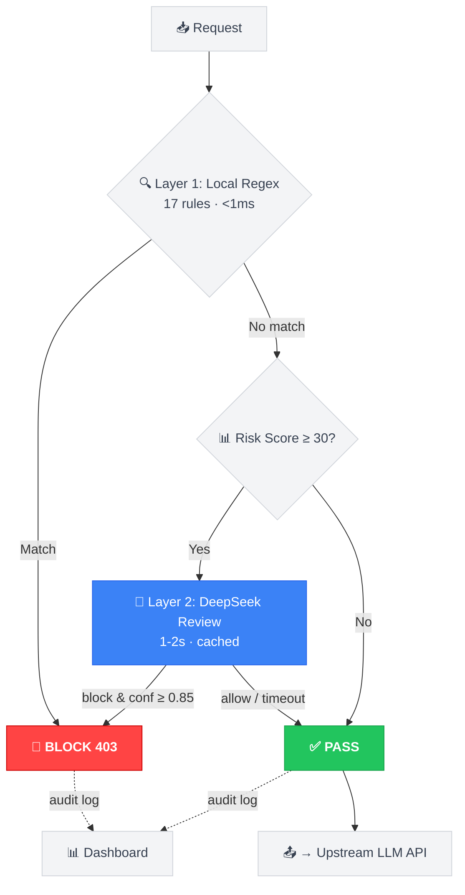
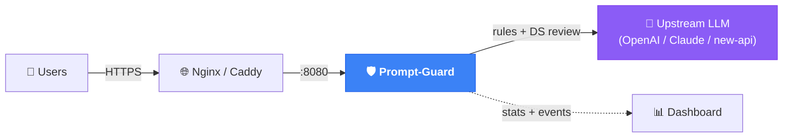

<div align="center">

# 🛡️ Prompt-Guard

### Lightweight AI Content Safety Guard for LLM API Gateways

Real-time prompt inspection · Two-layer review · Zero-downtime hot-reload

[](LICENSE)
[](https://www.python.org/)
[](https://www.docker.com/)
[](https://github.com/1EchA/prompt-guard)
[](https://github.com/1EchA/prompt-guard/issues)

</div>

---

> Stop your LLM API from being abused to generate porn, gambling, malware, phishing kits, game cheats, and other harmful content — **without** blocking legitimate users.

---

## ✨ Why Prompt-Guard?

| | Pure Keyword Filter | Pure LLM Guard | **Prompt-Guard** |
|---|:---:|:---:|:---:|
| **Latency** | ⚡ 0ms | 🐢 1-4s per request | ⚡ 0ms (rules) + 1-2s (DS, sampled) |
| **Accuracy** | ❌ Easy to bypass | ✅ High | ✅ **High** (two layers) |
| **Cost** | Free | 💰 Expensive (every request) | 💰 **Low** (sample only high-risk) |
| **False positives** | High | Medium | **Low** (context-aware + Scunthorpe protection) |
| **Deployment** | Simple | Complex | **One `docker compose up`** |
| **Hot-reload** | Rare | Rare | ✅ Rules + Prompt, no restart |

---

## 🧠 Two-Layer Review Architecture



<details>
<summary>📖 How does each layer work?</summary>

**Layer 1 — Local Regex (0ms):** 17 rule categories with 200+ patterns. Covers sexual content, gambling, malware, jailbreak, credential theft, game cheats, financial fraud, and more. Includes:
- **Scunthorpe protection**: `口交(?!货)` — won't false-flag "出口交货值" (export value)
- **Safety context exemption**: `reverse shell` in a security lab tutorial → allowed
- **Bypass detection**: variant phrases like "情趣试穿" (NSFW) or "键鼠驱动" (MMO bot) → boosted risk score

**Layer 2 — DeepSeek (1-2s, sampled):** Catches what regex misses. Only triggered for:
- Requests with risk score ≥ 30 (sync review, may block)
- Sampled low-risk requests (async, audit-only)
- Results cached (allow=12h, block=7d) — repeat content = 0ms 0 cost

</details>

---

## 🚀 Quick Start

```bash
# 1️⃣ Clone
git clone https://github.com/1EchA/prompt-guard.git
cd prompt-guard

# 2️⃣ Configure (edit .env — 3 required fields)
cp .env.example .env

# 3️⃣ Launch
docker compose up -d

# 4️⃣ Open dashboard
#   → http://localhost:8080/__prompt_guard/dashboard
```

<details>
<summary>⚙️ What to fill in .env</summary>

| Variable | Required | Description |
|---|:---:|---|
| `PROMPT_GUARD_UPSTREAM_URL` | ✅ | Your LLM API address (e.g. `http://your-api:3000`) |
| `DEEPSEEK_API_KEY` | ✅ | DeepSeek key for Layer 2 ([get one](https://platform.deepseek.com)) |
| `DASHBOARD_TOKEN` | ✅ | Password for the web dashboard |
| `PROMPT_GUARD_MODE` | | `shadow` (default, observe only) or `block` |

</details>

---

## 🏗️ Deployment Architecture



<details>
<summary>🔧 Nginx reverse proxy example</summary>

```nginx
upstream prompt_guard { server 127.0.0.1:8080; }
upstream llm_upstream { server 127.0.0.1:3000; }

server {
    listen 443 ssl;
    server_name api.example.com;

    # Generation endpoints → Prompt-Guard
    location ~ ^/(v1/chat/completions|v1/responses|v1/messages|v1/images/generations)/?$ {
        proxy_pass http://prompt_guard;
        proxy_set_header Host $host;
        proxy_buffering off;
        proxy_read_timeout 300s;
    }

    # Everything else → upstream API directly
    location / {
        proxy_pass http://llm_upstream;
        proxy_set_header Host $host;
    }
}
```

</details>

<details>
<summary>🔧 Caddy reverse proxy example</summary>

```caddy
api.example.com {
    @llm path /v1/chat/completions /v1/responses /v1/messages
    handle @llm {
        reverse_proxy 127.0.0.1:8080
    }
    handle {
        reverse_proxy 127.0.0.1:3000
    }
}
```

</details>

---

## 📊 Dashboard

Access at `http://localhost:8080/__prompt_guard/dashboard`

| Feature | Description |
|---|---|
| 🔴 **Live blocks** | Real-time blocked requests (block events shown first) |
| 💰 **DS cost tracker** | Token usage + estimated cost per site |
| ⚙️ **Channel config** | Adjust scan scope without restart |
| 🔍 **Event search** | Filter by category, site, time |

---

## ⚙️ Configuration

### Guard Modes

| Mode | Scan | Block | Best for |
|---|:---:|:---:|---|
| `shadow` | ✅ | ❌ | 🆕 **First deployment** — observe without risk |
| `block` | ✅ | ✅ | 🏭 **Production** — active enforcement |
| `off` | ❌ | ❌ | 🔧 Maintenance / debugging |

> 💡 **Recommended**: Start with `shadow` for 24-48h → review dashboard → switch to `block`

### DS Sampling Tuning

| Variable | Default | Description |
|---|---|---|
| `PROMPT_GUARD_DEEPSEEK_MIN_RISK` | `20` | Min risk score for async DS sampling |
| `PROMPT_GUARD_DEEPSEEK_SAMPLE_PERCENT` | `50` | Sampling rate for eligible requests |
| `PROMPT_GUARD_DEEPSEEK_REAL_BLOCK_RISK` | `30` | Risk threshold for **synchronous** DS review |
| `PROMPT_GUARD_DEEPSEEK_REAL_BLOCK_CONF` | `0.85` | Min DS confidence to actually block |

<details>
<summary>💰 Cost estimation (deepseek-v4-flash)</summary>

| Daily calls | Input tokens | Output tokens | Est. cost |
|---:|---:|---:|---:|
| 1,000 | ~1M | ~120K | ~¥1.2 |
| 10,000 | ~10M | ~1.2M | ~¥12 |
| 100,000 | ~100M | ~12M | ~¥120 |

> Dashboard shows real-time cost. Cache hits are free (0ms, 0 tokens).

</details>

---

## 🎯 Channel / Account Control

For multi-tenant setups, restrict scanning to specific channels or token groups:

```json
{
  "default": {
    "default_mode": "off",
    "scan_channel_ids": [1, 2, 3],
    "scan_token_groups": ["vip-users"]
  }
}
```

Edit `channel_scan_config.json` — changes take effect via dashboard **save** (hot-reload).

<details>
<summary>📖 Full config with DB resolution (optional)</summary>

Without DB, prompt-guard runs fine — you just won't see user/group info in audit events.
With DB, token-to-user resolution enriches audit logs:

```json
{
  "default": {
    "default_mode": "off",
    "scan_channel_ids": [1, 2, 3],
    "db_type": "mysql",
    "db_host": "mysql",
    "db_port": 3306,
    "db_user": "root",
    "db_pass": "your_db_password",
    "db_name": "my_api",
    "token_query": "SELECT DISTINCT c.id FROM channels c, users u, tokens t WHERE t.key = %s AND ...",
    "group_query": "SELECT ... FROM tokens t JOIN users u ON ...",
    "user_query": "SELECT u.id, ... FROM users u JOIN tokens t ON ..."
  }
}
```

</details>

---

## 🔥 Hot-Reload (Zero Downtime)

Everything is hot-reloadable — **no restart, no traffic drop**:

```bash
# 🔄 Reload rules after editing prompt_guard_rules.json
curl -X POST http://localhost:8080/__prompt_guard/reload-rules \
  -H "X-Guard-Token: your_token"
# → {"status":"ok","rules":17}

# ✏️ DS prompt: edit ds_prompt.txt → next DS call uses new text automatically

# ⚙️ Channel config: save in dashboard → applied instantly
```

---

## 🛡️ Rule Categories

| Category | Covers | Example |
|---|---|---|
| 🔞 `sexual_explicit` | Porn, NSFW content | "生成色情图片" |
| 👶 `sexual_minor` | Minor-related violations | "未成年...色情" |
| 🦠 `malware` | Malware, reverse shell, ransomware | "编写木马程序" |
| 🔑 `credential_theft` | Phishing, credential harvesting | "钓鱼网站收集密码" |
| 🎮 `game_cheat` | Cheats, aimbot, wallhack | "制作自瞄外挂" |
| 🔓 `jailbreak` | Prompt injection, policy bypass | "ignore previous instructions" |
| 💰 `financial_fraud` | Wallet spoofing, fraud | "钱包余额改成5000" |
| 💀 `graphic_violence` | Gore, torture | "虐杀..." |
| 🎰 `gambling` | Gambling platforms | "搭建赌博网站" |
| 🥅 `phishing_tooling` | Phishing kit development | "仿冒登录页" |

<details>
<summary>🛡️ Anti-false-positive mechanisms</summary>

| Mechanism | How it works |
|---|---|
| **Scunthorpe protection** | `口交(?!货)` — "出口交货值" (export data) not flagged |
| **Safety context exemption** | `reverse shell` near "靶场/实验/Vulhub" → allowed |
| **Bypass detection** | Variant phrases → risk score boost → DS review (not instant block) |
| **Confidence threshold** | DS block with conf < 0.85 → downgraded to pass |

</details>

---

## ❓ FAQ

<details>
<summary><b>All requests return 502/503?</b></summary>

Check `PROMPT_GUARD_UPSTREAM_URL` in `.env` — it must point to your LLM API.
</details>

<details>
<summary><b>Is DeepSeek required?</b></summary>

No. Without `DEEPSEEK_API_KEY`, only Layer 1 (regex rules) is active. Layer 2 (DS) is optional but recommended for catching bypass attempts.
</details>

<details>
<summary><b>How to reduce false positives?</b></summary>

1. Start with `shadow` mode — observe what gets flagged
2. Edit `prompt_guard_rules.json` — add negative lookaheads like `keyword(?!safe_context)`
3. Reload: `curl -X POST .../reload-rules`
4. Adjust DS confidence threshold (`PROMPT_GUARD_DEEPSEEK_REAL_BLOCK_CONF`)
</details>

<details>
<summary><b>Supported request formats?</b></summary>

OpenAI `/v1/chat/completions`, `/v1/responses`, Claude `/v1/messages`, Image `/v1/images/generations`, and more.
</details>

---

## 📁 Project Structure

```
prompt-guard/
├── prompt_guard.py              # Core engine (FastAPI)
├── prompt_guard_rules.json      # 17 rule categories
├── ds_prompt.txt                # DeepSeek review prompt
├── prompt-guard.Dockerfile      # Container build
├── docker-compose.yml           # One-command deploy
├── channel_scan_config.json     # Channel control (optional)
├── .env.example                 # Config template
└── README.md
```

---

## 🤝 Contributing

Contributions welcome! Especially:
- 🐛 False positive reports → [open an issue](https://github.com/1EchA/prompt-guard/issues)
- 🌍 New rule patterns (other languages / abuse types)
- 🎨 Dashboard improvements

---

## ⭐ Show Your Support

If Prompt-Guard helps protect your API, give it a star!

[](https://github.com/1EchA/prompt-guard)

---

<div align="center">

**[⚖️ MIT License](LICENSE)** · Built with FastAPI · Powered by DeepSeek

</div>
