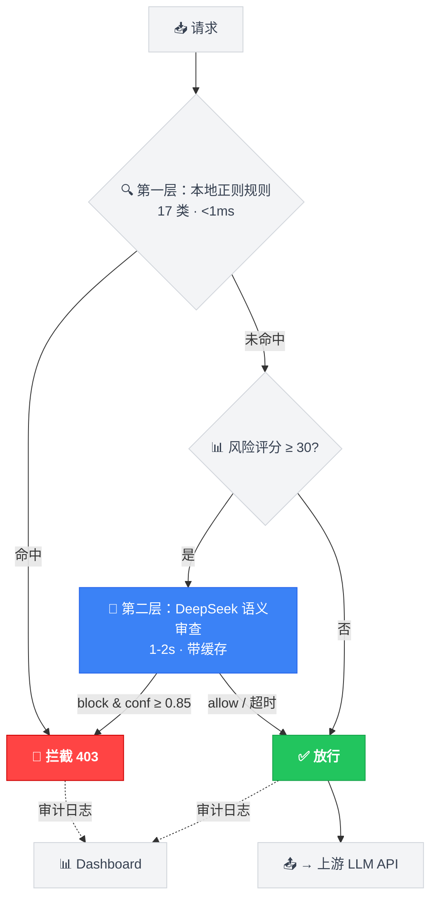
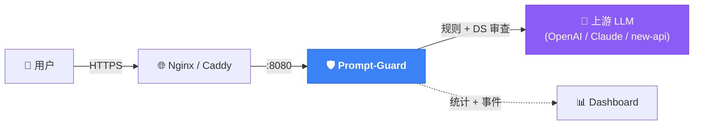

<div align="center">

# 🛡️ Prompt-Guard

### 轻量级 AI 内容安全网关 — 实时检测并拦截 LLM 违规请求

实时 Prompt 审查 · 两层防御 · 零停机热加载

[](LICENSE)
[](https://www.python.org/)
[](https://www.docker.com/)
[](https://github.com/1EchA/prompt-guard)
[](https://github.com/1EchA/prompt-guard/issues)

🌐 **简体中文** | [English](README.md)

</div>

---

> 防止你的 LLM API 被滥用于生成色情、赌博、恶意软件、钓鱼网站、游戏外挂等违法内容 —— 同时**不影响**正常用户体验。

---

## ✨ 为什么选择 Prompt-Guard？

| | 纯关键词过滤 | 纯 LLM 审查 | **Prompt-Guard** |
|---|:---:|:---:|:---:|
| **延迟** | ⚡ 0ms | 🐢 每个请求 1-4s | ⚡ 0ms（规则）+ 1-2s（DS 采样）|
| **准确率** | ❌ 易绕过 | ✅ 高 | ✅ **高**（两层互补）|
| **成本** | 免费 | 💰 贵（每请求都调）| 💰 **低**（仅高风险采样）|
| **误杀率** | 高 | 中 | **低**（语境感知 + Scunthorpe 防护）|
| **部署** | 简单 | 复杂 | **一行 `docker compose up`** |
| **热加载** | 少见 | 少见 | ✅ 规则 + Prompt，不重启 |

---

## 🧠 两层审查架构



<details>
<summary>📖 每一层怎么工作？</summary>

**第一层 — 本地正则规则（0ms）：** 17 类规则、200+ 模式。覆盖色情、赌博、恶意软件、越狱、凭证窃取、游戏外挂、金融诈骗等。内置：
- **Scunthorpe 防护**：`口交(?!货)` —— 不会误拦"出口交货值"（经济数据）
- **安全语境豁免**：`reverse shell` 出现在靶场实验中 → 放行
- **绕过检测**：变体话术如"情趣试穿"（色情）、"键鼠驱动"（MMO 挂机）→ 风险分加分

**第二层 — DeepSeek（1-2s，采样）：** 抓本地规则漏掉的灰色地带。仅对以下请求触发：
- 风险分 ≥ 30（同步审查，可拦截）
- 低风险请求按比例采样（异步，仅审计）
- 结果缓存（allow=12h, block=7d）—— 重复内容 0ms 0 成本

</details>

---

## 🚀 快速开始

```bash
# 1️⃣ 克隆
git clone https://github.com/1EchA/prompt-guard.git
cd prompt-guard

# 2️⃣ 配置（编辑 .env — 3 个必填项）
cp .env.example .env

# 3️⃣ 启动
docker compose up -d

# 4️⃣ 打开面板
#   → http://localhost:8080/__prompt_guard/dashboard
```

<details>
<summary>⚙️ .env 里填什么</summary>

| 变量 | 必填 | 说明 |
|---|:---:|---|
| `PROMPT_GUARD_UPSTREAM_URL` | ✅ | 你的 LLM API 地址（如 `http://your-api:3000`）|
| `DEEPSEEK_API_KEY` | ✅ | 第二层审查用的 DeepSeek key（[申请](https://platform.deepseek.com)）|
| `DASHBOARD_TOKEN` | ✅ | 面板访问密码 |
| `PROMPT_GUARD_MODE` | | `shadow`（默认，仅观察）或 `block` |

</details>

---

## 🏗️ 部署架构



<details>
<summary>🔧 Nginx 反代示例</summary>

```nginx
upstream prompt_guard { server 127.0.0.1:8080; }
upstream llm_upstream { server 127.0.0.1:3000; }

server {
    listen 443 ssl;
    server_name api.example.com;

    # 生成类端点 → Prompt-Guard
    location ~ ^/(v1/chat/completions|v1/responses|v1/messages|v1/images/generations)/?$ {
        proxy_pass http://prompt_guard;
        proxy_set_header Host $host;
        proxy_buffering off;
        proxy_read_timeout 300s;
    }

    # 其他请求 → 上游 API
    location / {
        proxy_pass http://llm_upstream;
        proxy_set_header Host $host;
    }
}
```

</details>

<details>
<summary>🔧 Caddy 反代示例</summary>

```caddy
api.example.com {
    @llm path /v1/chat/completions /v1/responses /v1/messages
    handle @llm {
        reverse_proxy 127.0.0.1:8080
    }
    handle {
        reverse_proxy 127.0.0.1:3000
    }
}
```

</details>

---

## 📊 Dashboard 面板

访问 `http://localhost:8080/__prompt_guard/dashboard`

| 功能 | 说明 |
|---|---|
| 🔴 **实时拦截** | block 事件优先显示，实时推送 |
| 💰 **DS 成本追踪** | token 用量 + 按站点估算费用 |
| ⚙️ **渠道配置** | 在线调整扫描范围，无需重启 |
| 🔍 **事件筛选** | 按分类、站点、时间过滤 |

---

## ⚙️ 配置

### 运行模式

| 模式 | 扫描 | 拦截 | 适用场景 |
|---|:---:|:---:|---|
| `shadow` | ✅ | ❌ | 🆕 **首次部署** —— 零风险观察 |
| `block` | ✅ | ✅ | 🏭 **生产环境** —— 主动拦截 |
| `off` | ❌ | ❌ | 🔧 维护 / 调试 |

> 💡 **建议**：先用 `shadow` 跑 24-48 小时 → 看 Dashboard 确认无误 → 切 `block`

### DS 采样调优

| 变量 | 默认值 | 说明 |
|---|---|---|
| `PROMPT_GUARD_DEEPSEEK_MIN_RISK` | `20` | 异步 DS 采样的最低风险分 |
| `PROMPT_GUARD_DEEPSEEK_SAMPLE_PERCENT` | `50` | 异步采样率（%）|
| `PROMPT_GUARD_DEEPSEEK_REAL_BLOCK_RISK` | `30` | **同步** DS 裁决的风险分阈值 |
| `PROMPT_GUARD_DEEPSEEK_REAL_BLOCK_CONF` | `0.85` | DS 阻断的最低置信度 |

<details>
<summary>💰 成本估算（deepseek-v4-flash）</summary>

| 日调用量 | 输入 Token | 输出 Token | 估算费用 |
|---:|---:|---:|---:|
| 1,000 | ~1M | ~120K | ~¥1.2 |
| 10,000 | ~10M | ~1.2M | ~¥12 |
| 100,000 | ~100M | ~12M | ~¥120 |

> Dashboard 实时显示实际花费。缓存命中免费（0ms, 0 token）。

</details>

---

## 🎯 渠道 / 账号控制

多租户场景下，可以精确限制只扫描特定渠道或分组：

```json
{
  "default": {
    "default_mode": "off",
    "scan_channel_ids": [1, 2, 3],
    "scan_token_groups": ["vip用户"]
  }
}
```

编辑 `channel_scan_config.json` —— 在 Dashboard 保存即热加载生效。

<details>
<summary>📖 带数据库解析的完整配置（可选）</summary>

不配数据库也能正常运行，只是审计事件里不会显示用户/分组信息。
配了数据库后，token→用户解析会丰富审计日志：

```json
{
  "default": {
    "default_mode": "off",
    "scan_channel_ids": [1, 2, 3],
    "db_type": "mysql",
    "db_host": "mysql",
    "db_port": 3306,
    "db_user": "root",
    "db_pass": "your_db_password",
    "db_name": "my_api",
    "token_query": "SELECT DISTINCT c.id FROM channels c, users u, tokens t WHERE t.key = %s AND ...",
    "group_query": "SELECT ... FROM tokens t JOIN users u ON ...",
    "user_query": "SELECT u.id, ... FROM users u JOIN tokens t ON ..."
  }
}
```

</details>

---

## 🔥 热加载（零停机）

所有配置都支持热加载 —— **不重启、不断流**：

```bash
# 🔄 改完规则后重载
curl -X POST http://localhost:8080/__prompt_guard/reload-rules \
  -H "X-Guard-Token: your_token"
# → {"status":"ok","rules":17}

# ✏️ DS Prompt：编辑 ds_prompt.txt → 下次 DS 调用自动生效

# ⚙️ 渠道配置：Dashboard 保存 → 即时生效
```

---

## 🛡️ 规则分类

| 分类 | 覆盖场景 | 示例 |
|---|---|---|
| 🔞 `sexual_explicit` | 色情内容 / NSFW | "生成色情图片" |
| 👶 `sexual_minor` | 未成年人相关违规 | "未成年...色情" |
| 🦠 `malware` | 恶意软件 / 反向 shell | "编写木马程序" |
| 🔑 `credential_theft` | 钓鱼 / 凭证窃取 | "钓鱼网站收集密码" |
| 🎮 `game_cheat` | 游戏外挂 / 作弊 | "制作自瞄外挂" |
| 🔓 `jailbreak` | 越狱 / Prompt 注入 | "忽略之前的指令" |
| 💰 `financial_fraud` | 金融诈骗 / 钱包伪造 | "钱包余额改成5000" |
| 💀 `graphic_violence` | 暴力 / 血腥 | "虐杀..." |
| 🎰 `gambling` | 赌博平台 | "搭建赌博网站" |
| 🥅 `phishing_tooling` | 钓鱼工具开发 | "仿冒登录页" |

<details>
<summary>🛡️ 反误判机制</summary>

| 机制 | 工作原理 |
|---|---|
| **Scunthorpe 防护** | `口交(?!货)` —— "出口交货值"（经济数据）不误拦 |
| **安全语境豁免** | `reverse shell` 附近出现"靶场/实验/Vulhub" → 放行 |
| **绕过检测** | 变体话术 → 风险分加分 → 送 DS 审查（不直接 block）|
| **置信度阈值** | DS block 但 conf < 0.85 → 降级放行 |

</details>

---

## ❓ 常见问题

<details>
<summary><b>所有请求都返回 502/503？</b></summary>

检查 `.env` 里的 `PROMPT_GUARD_UPSTREAM_URL` —— 必须指向你的 LLM API 地址。
</details>

<details>
<summary><b>DeepSeek 是必须的吗？</b></summary>

不是。不配 `DEEPSEEK_API_KEY` 时，只有第一层（正则规则）生效。第二层（DS）是可选的，但建议开启以抓绕过尝试。
</details>

<details>
<summary><b>如何减少误判？</b></summary>

1. 先用 `shadow` 模式 —— 观察哪些被标记
2. 编辑 `prompt_guard_rules.json` —— 加负向前瞻如 `关键词(?!安全语境)`
3. 热加载：`curl -X POST .../reload-rules`
4. 调整 DS 置信度阈值（`PROMPT_GUARD_DEEPSEEK_REAL_BLOCK_CONF`）
</details>

<details>
<summary><b>支持哪些请求格式？</b></summary>

OpenAI `/v1/chat/completions`、`/v1/responses`、Claude `/v1/messages`、图片 `/v1/images/generations` 等。
</details>

---

## 📁 项目结构

```
prompt-guard/
├── prompt_guard.py              # 核心引擎（FastAPI）
├── prompt_guard_rules.json      # 17 类规则
├── ds_prompt.txt                # DeepSeek 审查提示词
├── prompt-guard.Dockerfile      # 容器构建
├── docker-compose.yml           # 一键部署
├── channel_scan_config.json     # 渠道控制（可选）
├── .env.example                 # 配置模板
├── README.md                    # English
└── README_zh.md                 # 简体中文
```

---

## 🤝 参与贡献

欢迎贡献！特别是：
- 🐛 误判反馈 → [提 Issue](https://github.com/1EchA/prompt-guard/issues)
- 🌍 新规则（其他语言 / 滥用类型）
- 🎨 Dashboard 改进

---

## ⭐ 支持一下

如果 Prompt-Guard 帮你保护了 API，给个 Star 吧！

[](https://github.com/1EchA/prompt-guard)

---

<div align="center">

**[⚖️ MIT 开源协议](LICENSE)** · 基于 FastAPI 构建 · 由 DeepSeek 驱动

</div>
